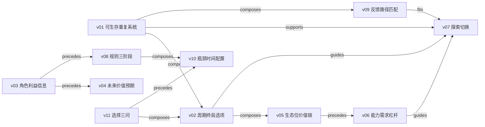

# 《记忆承载》方法 Skill Index

> 由 cangjie-skill 从碧树西风 101 篇冻结训练文章中蒸馏，产出 **11** 个通过 V1/V2/V3 的原子方法 skill。处理时间：2026-07-21。

## 关于语料

- **对象**：碧树西风 / 记忆承载作者与账号簇
- **时间范围**：2021-12 至 2026-07
- **一句话主旨**：普通人要改善处境，不能只在既定规则里增加努力，而要先看清周期、利益、预期和自身位置，再用可重复、可生存的选择系统积累新的选项。
- **整书理解**：[BOOK_OVERVIEW.md](./BOOK_OVERVIEW.md)
- **三重验证**：[verified.md](./verified.md)
- **术语词典**：[GLOSSARY.md](./GLOSSARY.md)
- **精华长文**：[DIGEST.md](./DIGEST.md)（阶段 5 生成）

## Skill 列表

### 选择、风险与长期

- [`choice-basis-three-question-audit`](./choice-basis-three-question-audit/SKILL.md) — “基于什么选择”三问审计
- [`repeatable-survival-decision-system`](./repeatable-survival-decision-system/SKILL.md) — 可生存的重复决策系统
- [`cycle-endgame-optionality-map`](./cycle-endgame-optionality-map/SKILL.md) — 周期—终局—选项倒推

### 角色、信息与呈现

- [`role-incentive-hidden-information-audit`](./role-incentive-hidden-information-audit/SKILL.md) — 角色利益—成本—隐含信息审计
- [`future-value-expectation-boundary`](./future-value-expectation-boundary/SKILL.md) — 事实边界下的未来价值与预期管理

### 位置、路径与转型

- [`ecological-niche-value-chain-audit`](./ecological-niche-value-chain-audit/SKILL.md) — 生态位与价值链位置审计
- [`ability-demand-leverage-path`](./ability-demand-leverage-path/SKILL.md) — 能力—需求—杠杆路径诊断
- [`feedback-cycle-path-fit`](./feedback-cycle-path-fit/SKILL.md) — 反馈机制—路径周期匹配
- [`explore-exploit-transition-ladder`](./explore-exploit-transition-ladder/SKILL.md) — 根据地—探索钉子—增长率切换

### 规则与执行

- [`rules-player-to-game-designer`](./rules-player-to-game-designer/SKILL.md) — 遵守—打破—建立规则
- [`bottleneck-time-allocation`](./bottleneck-time-allocation/SKILL.md) — “由东”瓶颈与单位时间配置

## 引用图

## 推荐学习顺序

1. `choice-basis-three-question-audit`：先学会暴露选择依据与取舍。
2. `repeatable-survival-decision-system`：建立不出局、可复盘的底盘。
3. `cycle-endgame-optionality-map`：把单轮决策放进多周期和长期选项。
4. `role-incentive-hidden-information-audit`：理解组织和交易中的真实机制。
5. `ecological-niche-value-chain-audit`：定位自己处在价值增长还是蚕食位置。
6. `ability-demand-leverage-path`：从位置走到可验证的赚钱/交付路径。
7. `feedback-cycle-path-fit`：让路径与个人反馈耐受度匹配。
8. `explore-exploit-transition-ladder`：用根据地和探索钉子完成转型。
9. `future-value-expectation-boundary`：诚实呈现可验证的未来增量。
10. `rules-player-to-game-designer`：从规则内执行升级到建立系统。
11. `bottleneck-time-allocation`：在当前阶段找到真正控制结果的支点。

## 审计轨迹

- [原始候选](./candidates/)
- [去重映射](./stage1.5-merge-map.md)
- [未独立成立的单元](./rejected/)
- 所有方法只使用 train 语料；holdout 与 OCR 隔离语料未参与。
